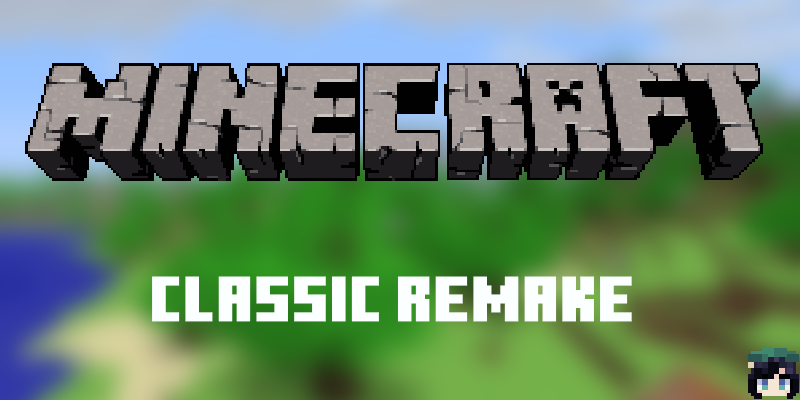

# Minecraft-Classic-Remake

The goal is to make a "Minecraft PE 0.10.5 Remake" programmed in Java 17 with LWJGL 3. Currently, the game is being refactored and cannot be played. But when the game is done, there will be a skeleton summary of this project.

## Current Job

* Implement the terrain generation of Minecraft PE 0.1.0.

## The goal

- [ ] All blocks that are in Minecraft PE 0.10.5
- [ ] Implement a simple world using terrain generation including default world and simple biomes like Minecraft.
- [ ] Implement Survival Mode as default.
- [ ] Day-night Circle.
- [ ] Animals and monsters.

## How to Test the Game

#### Windows

To build, just execute

> gradlew.bat build

then

> gradlew.bat run

There you go!

#### Linux && MacOS

I have no computer running MacOS, but I got a dual system, Windows and Ubuntu.
I'm convinced that it is able to run by typing the following 3 commands.

> chmod +x gradlew
> 
> ./gradlew build
> 
> ./gradlew run

# Have fun!

