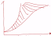

# 生态学

教材： 判定体系

​			 	eg. 种群

​	定义	

​	特征	数量特征 空间特征 遗传特征

命题人：

​	组成

​	结构

​	功能

​	演变

---

# 生态系统的结构组成

## 细胞

## 组织

## 器官

## 系统

​	具有层次性：每一个系统都是由若干个子系统组成（套娃）。

​	组成，结构，功能，演变。

## 个体

​	对于微观影响大，对于宏观影响小。

## 种群

* 课外的名字，听起来具体的，就可以作为一个种群。
* 注意！蝴蝶的小时候是毛毛虫，所以只说自然区域内的全部某种蝴蝶不是种群！要包括毛毛虫；还有青蛙和蝌蚪。
* 树的高度平均大于1.4m叫乔木，平均小于1.4m叫灌木，死了的树叫朽木（非生物）。【所以这都不叫种群！】
* 如果某个填空，如果出现了“无影响”这个选项，先考虑无影响，再考虑从偏大还是偏小考虑。

### 组成：

​	在一定**自然区域**[^2]内，同一**物种**[^3]生物个体的集合。

[^2]: 	里面的生物，生物天性大于理智。**自然区域不等同于无机环境**【高考不能写无机环境，转而写*非生物的物质和能量*】。
[^3]: 物种里面的“种”和种群里面的“种”。一个物种在很大的区域可以分布成许多的种群，但是一个种群里面只能有一个种群。【要先有分类依据，区分概念是在哪里学的】

### 研究：

#### 种群密度： 

​	**单位**体积或**单位**面积内的个体数量。

* 种群中最基本的数量特征。

##### 调查方法：

###### 标志重捕法

* 适用： 活动范围大，活动能力强的个体。

$$
结果 = \frac {1抓 * 2抓} {2标}
$$
* 第二次抓的有可能偏小，所以估计值比实际值偏大。

* 注意： 标志物不易脱落，不宜过于醒目，不应影响生物的正常生命活动【如果是老鼠，剃光了毛之后，就不会被吃了，就影响了正常的生理活动】，`不能有大的迁入，迁出，出生，死亡（迁入和出生其实是没问题的，因为种群密度增大，估算结果也增大; 如果死亡和迁出，则标记的数量就有变）`*【种群是相对稳定的，即迁入迁出出生死亡对实验没关系】*。

###### 样方法

* 适用：植物，互动能力弱，活动范围小的动物。

> eg. 虫卵，跳蝻，蚜虫，（蚯蚓：夹断的宁怎么说）

* 画方块：

	等距取样法：等距取几个样方。

	五点取样法： 左上右上左下右下中间 【n点取样法】

* 数数： 取两边及夹角。

> ”为什么不用圆⚪？因为为了实验数据精准，操作简便，减少实验误差“

> ”样方选取大小？依照待测物体决定“

* 问题：

	样方间距过小： 提升样方间距

	取到偏差很大的数据：*不可去除*【要保证随机抽样】

	样方不能太少： 保证没有偶然误差

###### 黑光灯诱捕法

* 挡板挡虫，灯光诱虫，毒瓶杀虫

> 用酒精是在群落学的。				

###### 显微计数法

【细胞版基数法，血细胞计数法】

器材：血细胞计数板

##### 统计方法：

* 【数学表达形式】 种群表达形式

###### J型曲线：

​	指数型增长曲线
$$
N_t = N_0 · λ^n
$$
* 当λ = 1，种群相对稳定；λ < 1，种群是衰退型；λ > 1，种群是增长型

* 增长率：是一个普词【无单位名称】
  $$
  增长率 = λ - 1 = \frac {N_t - N_0} {N_0} × 100\% = 出生率 - 死亡率
  $$
  增长速率：是一个生物学名词【因为单位总有一个生物学量词】

  ​	单位时间[^4]内的增长量。

$$
增长速率 = \frac {N_t - N_0} {t}
$$

[^4]: 假设增长速率的单位时间对应增长率的单位时间，则`N0 * 增长率 = 增长速率`

* 画图：  开始的时候，在y轴上的截距要大于0

* 判断依据： 理想条件下； 实验室条件； 无环境阻力；食物空间充裕，气候适宜； 外来物种入侵早期阶段【外来物种要nb】

  本质： 活着爽

######  S型曲线：

​	【逻辑斯绨曲线】

* 画图：  开始的时候，必须有初始值
* 原因：  存在环境阻力，非理想状态
* 最终围绕一个值波动：
  * 环境容纳量（k值）
  * 在**环境条件不被破坏**[^5]的情况下，一定空间中所能**维持**[^6]的种群最大数量。
  * 达到k值不再增加的原因：
    * 前因：资源和空间有限；当种群密度增大时，种内斗争加剧，天敌数量增加。
    * 后果：导致出生率下降，死亡率上升，最终达到动态平衡。

* 增长率：

  ​	在这里定量分析行不通，所以用`增长率 = 出生率 - 死亡率`进行定性分析。

  ​	由于出生率逐渐降低，死亡率逐渐升高；当`出生率 = 死亡率`时，增长率为0，于是种群数量不再增长。【增长率先上升后向下】

  增长速率：

  ​	在`k/2`这个点，增长速率最大，而不是增长率【当基数低的时候，增长率的最大值才最有可能出现，所以增长率的最大值应该比`k/2`小】

  * 增长率最大的时候，不是增长速率最大的曲线。【因为增长率与初始值有关】
  * 增长速率的曲线比增长率滞后。（超过种群最大的增长率之后，增长速率才有可能出现最大值）
  * 但是很多老师对于增长率和增长速率是不懂的！就算是命题人本身！【但是如果特别不幸运，遇到了这种情况，一般来说解答题目是用不到这个概念的】

* 防治害虫：优先降低k值，再是控制在`k/2`以内。【治标前先治本】

  对于有利：优先维持在`k/2`，再是提高k值。【提高k值有经济成本】

  ​	最大日捕捞量：在k值时

  ​	可持续增长（最大速率）：在`k/2`值时

> J型曲线一开始为什么不是S型曲线？
>
> A：因为S型曲线有环境阻力，J型曲线无环境阻力；J型曲线的增长率恒定不变，S型曲线增长率先增大后减小。

阴影部分： 

* 生态学：环境阻力
* 进化学：被淘汰的个体

[^5]: 环境近乎不变
[^6]: 如果一个物种突然大爆发达到了某个数量【这里环境不是近乎不变】，最终又降了下来并在某个值上下波动。k值是最终波动的值。

### 结构

### 功能

### 演变

#### 内因

##### 出生率

##### 死亡率

## 群落

## 生态系统

## 生物圈

# 内部生态

内环境。

# 外部生态

