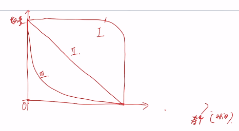

# 生态学

教材： 判定体系

​			 	eg. 种群

​	定义	

​	特征	数量特征 空间特征 遗传特征

命题人：

​	组成

​	结构

​	功能

​	演变

---

# 生态系统的结构组成

## 细胞

## 组织

## 器官

## 系统

​	具有层次性：每一个系统都是由若干个子系统组成（套娃）。

​	组成，结构，功能，演变。

## 个体

​	对于微观影响大，对于宏观影响小。

## 种群

* 课外的名字，听起来具体的，就可以作为一个种群。
* 注意！蝴蝶的小时候是毛毛虫，所以只说自然区域内的全部某种蝴蝶不是种群！要包括毛毛虫；还有青蛙和蝌蚪。
* 树的高度平均大于1.4m叫乔木，平均小于1.4m叫灌木，死了的树叫朽木（非生物）。【所以这都不叫种群！】
* 如果某个填空，如果出现了“无影响”这个选项，先考虑无影响，再考虑从偏大还是偏小考虑。

### 组成

​	在一定**自然区域**[^2]内，同一**物种**[^3]生物个体的集合。

[^2]: 	里面的生物，生物天性大于理智。**自然区域不等同于无机环境**【高考不能写无机环境，转而写*非生物的物质和能量*】。
[^3]: 物种里面的“种”和种群里面的“种”。一个物种在很大的区域可以分布成许多的种群，但是一个种群里面只能有一个种群。【要先有分类依据，区分概念是在哪里学的】

#### 种群密度

​	**单位**体积或**单位**面积内的个体数量。

* 种群中最基本的数量特征。

##### 调查方法

###### 标志重捕法

* 适用： 活动范围大，活动能力强的个体。

$$
结果 = \frac {1抓 * 2抓} {2标}
$$
* 第二次抓的有可能偏小，所以估计值比实际值偏大。

* 注意： 标志物不易脱落，不宜过于醒目，不应影响生物的正常生命活动【如果是老鼠，剃光了毛之后，就不会被吃了，就影响了正常的生理活动】，`不能有大的迁入，迁出，出生，死亡（迁入和出生其实是没问题的，因为种群密度增大，估算结果也增大; 如果死亡和迁出，则标记的数量就有变）`*【种群是相对稳定的，即迁入迁出出生死亡对实验没关系】*。

###### 样方法

* 适用：植物，互动能力弱，活动范围小的动物。

> eg. 虫卵，跳蝻，蚜虫，（蚯蚓：夹断的宁怎么说）

* 画方块：

	等距取样法：等距取几个样方。

	五点取样法： 左上右上左下右下中间 【n点取样法】

* 数数： 取两边及夹角。

> ”为什么不用圆⚪？因为为了实验数据精准，操作简便，减少实验误差“

> ”样方选取大小？依照待测物体决定“

* 问题：

	样方间距过小： 提升样方间距

	取到偏差很大的数据：*不可去除*【要保证随机抽样】

	样方不能太少： 保证没有偶然误差

###### 黑光灯诱捕法

* 挡板挡虫，灯光诱虫，毒瓶杀虫

> 用酒精是在群落学的。				

###### 显微计数法

【细胞版基数法，血细胞计数法】

器材：血细胞计数板

##### 种群数量随时间变化曲线

* 【数学表达形式】 种群表达形式

###### J型曲线

​	指数型增长曲线
$$
N_t = N_0 · λ^n
$$
* 当λ = 1，种群相对稳定；λ < 1，种群是衰退型；λ > 1，种群是增长型

* 增长率：是一个普词【无单位名称】
  $$
  增长率 = λ - 1 = \frac {N_t - N_0} {N_0} × 100\% = 出生率 - 死亡率
  $$
  增长速率：是一个生物学名词【因为单位总有一个生物学量词】

  ​	单位时间[^4]内的增长量。

$$
增长速率 = \frac {N_t - N_0} {t}
$$

[^4]: 假设增长速率的单位时间对应增长率的单位时间，则`N0 * 增长率 = 增长速率`

* 画图：  开始的时候，在y轴上的截距要大于0

* 判断依据： 理想条件下； 实验室条件； 无环境阻力；食物空间充裕，气候适宜； 外来物种入侵早期阶段【外来物种要nb】

  本质： 活着爽

######  S型曲线

​	【逻辑斯绨曲线】

* 画图：  开始的时候，必须有初始值
* 原因：  存在环境阻力，非理想状态
* 最终围绕一个值波动：
  * 环境容纳量（k值）
  * 在**环境条件不被破坏**[^5]的情况下，一定空间中所能**维持**[^6]的种群最大数量。
  * 达到k值不再增加的原因：
    * 前因：资源和空间有限；当种群密度增大时，种内斗争加剧，天敌数量增加。
    * 后果：导致出生率下降，死亡率上升，最终达到动态平衡。

* 增长率：

  ​	在这里定量分析行不通，所以用`增长率 = 出生率 - 死亡率`进行定性分析。

  ​	由于出生率逐渐降低，死亡率逐渐升高；当`出生率 = 死亡率`时，增长率为0，于是种群数量不再增长。【增长率先上升后向下】

  增长速率：

  ​	在`k/2`这个点，增长速率最大，而不是增长率【当基数低的时候，增长率的最大值才最有可能出现，所以增长率的最大值应该比`k/2`小】

  * 增长率最大的时候，不是增长速率最大的曲线。【因为增长率与初始值有关】
  * 增长速率的曲线比增长率滞后。（超过种群最大的增长率之后，增长速率才有可能出现最大值）
  * 但是很多老师对于增长率和增长速率是不懂的！就算是命题人本身！【但是如果特别不幸运，遇到了这种情况，一般来说解答题目是用不到这个概念的】

* 防治害虫：优先降低k值，再是控制在`k/2`以内。【治标前先治本】

  对于有利：优先维持在`k/2`，再是提高k值。【提高k值有经济成本】

  ​	最大日捕捞量：在k值时

  ​	可持续增长（最大速率）：在`k/2`值时

> J型曲线一开始为什么不是S型曲线？
>
> A：因为S型曲线有环境阻力，J型曲线无环境阻力；J型曲线的增长率恒定不变，S型曲线增长率先增大后减小。

阴影部分： 

* 生态学：环境阻力
* 进化学：被淘汰的个体

##### 年龄存活曲线

Ⅰ：在年轻时期，几乎不死；过了某个点，生存能力急剧下降

Ⅱ：在各个年龄时期，死亡率几乎相同

Ⅲ：在年轻时期，死亡率很高；过了某个点，死亡率就降低了

对应生物的两个生殖对策

​	K对策：养一个成一个【Ⅰ曲线】

​	R对策：养一堆成一个【Ⅲ曲线】

[^5]: 环境近乎不变
[^6]: 如果一个物种突然大爆发达到了某个数量【这里环境不是近乎不变】，最终又降了下来并在某个值上下波动。k值是最终波动的值。

### 结构

#### 空间结构

##### 均匀分布

排列比较整齐。

* 本质上一种种内竞争的结果。
  * 竞争能力强，领地就大；竞争能力弱，领地就小。
  * 所以大概率是一种势均力敌的竞争。

* 也常见于人工种群。
  * 本质上也是种内竞争，为了防止种内竞争带来的经济损失。
* 可以看成一种较大范围的集群分布。

> eg. 企鹅🐧在产卵的时候；植物

##### 集群分布

排列一群一群的。

原因：

* 不同的环境分布。
* 与母性植株有关。
  * 仅存在与植物中，在母性植株的旁边会有许多子代。

* 社会型行为。
* 抗性更强。
  * 对环境阻力的抗性。
  * eg. 一群斑马在一起，被捕食的概率很低，因为具有迷惑性。

##### 随机分布

排列随机。

* 个体可以独立生存，不受其它种群干扰。

### 功能

* 从生态学而言：
  * 是繁殖的基本单位。
    * 只有一个生物是繁殖不下去的，只有一个种群才能繁殖下去。所以只有一个生物，实质上这个生物是灭绝了。
  * 是生物群落的基本组成单位。
* 从进化学而言:
  * 是生物进化的基本单位。
    * 个体的性状是无法传递的，但群体的性状是可以传递的。
  * 是基因库的最小单位。

### 演变

* 主要围绕种群密度的变化。
  * 以数量为指标的，以来源和去路两个方面进行衡量。

#### 种群密度

直接决定

+ 出生率 '+'

+ 迁入率 '+'

- 死亡率 '-'

- 迁出率 '-'

间接影响

* 年龄组成
  * 成分
      * 幼年：主要影响死亡率。
      * 成年：有生育能力的个体。主要影响出生率。
      * 老年：丧失生育能力的个体。主要影响死亡率。
  * 类型
      * 增长型：幼年期可以很快成年，进而参与增加出生率；参与成年期个体远大于老年期个体，所以成年期对出生率的影响远大于老年期对死亡率的影响。
      * 稳定型：
      * 衰退型：
* 性别比例
  * 本质上只影响出生率。
  * 类型：
    * ♂ > ♀：一般都是这样。
    * ♂ = ♀：
    * ♂ < ♀：

> 为什么不是雌性大于雄性，于是雄性迁入，影响了迁入率？
>
> 种群间大部分都是具有地理隔离的。并且迁入率一般都是零零散散的迁入。

外部因素

* 环境因素
  * 气候（最重要）
* 生物因素
  * 捕食，寄生

## 群落

是种群的集合。

单独生物属性最高的层次。

### 组成

在一定自然区域内，所有种群的集合。

#### 物种丰富度

> 我和我邻居算两个种群吗？
>
> 人是社会性很强的个体，不能放在生物学里面。

#### 优势种

大小，数量和生产力对群落产生重大影响。【不同题目不一样】

个体数量多，是生产者就*大概*判作优势种。

#### 种间关系

* “离开对方活不了”型

  * 对对方好：互利共生 【与内共生假说类似】
    * 甲方对乙方好，且离开乙方活不了；乙方离开甲方能活。
    * 表现在图像中，同增同减，与正反馈调节类似；两条曲线变化一致（同步性变化）
    * 甲一定要给能量给乙，乙也会给甲一份（双向箭头）

  * 对对方坏：寄生
    * 甲方对乙方坏，且离开乙方活不了；乙方离开甲方能活。
    * 仅甲给能量给乙（单向箭头）【白嫖】
    * 一般是在一个个体中

* “离开对方也能活”型
  * 捕食
    * 对于捕食来说，只存在与个体间的"你死我活"，而不是种群间的。
    * 吃多个个体一般来说是捕食，比如说“蚊子吸血”
    * 图像具有滞后性
  * 竞争
    * 往往是种群间的“你死我活”
    * 图像是同步性变化
      * 为什么两个势均力敌的种群，A增多之后为什么又会自己降低呢？因为A有种内斗争，并且还有天敌。

#### 土壤中小动物的种群数量研究

酒精补虫，灯光驱虫

统计方法：记名计算法，目测估计法

### 结构

#### 空间结构

* 垂直结构

  * 对于动物，与食物和栖息地有关；对于植物，与光照有关。

    在水域生态系统，与压强有关。

  * 垂直结构是从表面上建立坐标系上的垂直。【立足于一个点的上下就是垂直，否则就是水平】

* 水平结构

  * 取决于环境。

自然界中是不存在只有垂直结构没有水平结构或只有水平结构不存在垂直结构的。

##### 时间结构

##### 层片结构

### 功能

见生态系统的功能。

### 演替

* 往好了变
  * 趋势
    * 组成：物种多样化
    * 结构：结构复杂化
    * 功能：功能完善化
    * 演变：最终达到相对稳定的状态

## 生态系统

## 生物圈

# 内部生态

内环境。

# 外部生态

